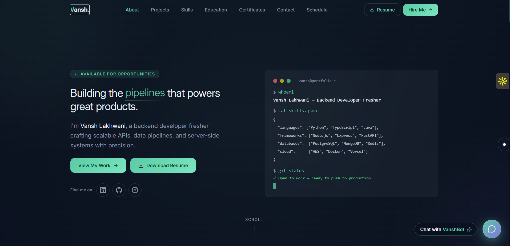
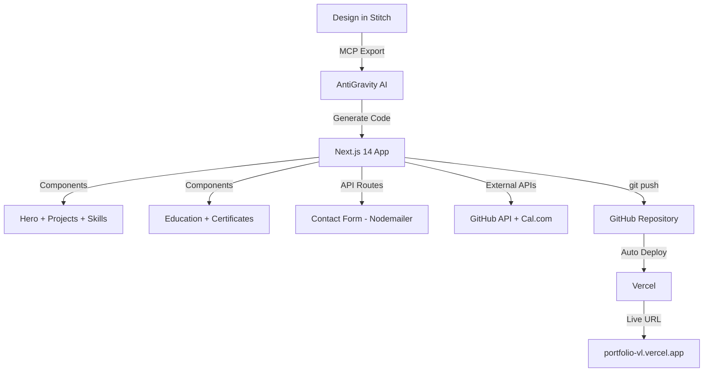

# Vansh Lakhwani — Portfolio Website

<p align="center">
  
</p>

<h3 align="center">Vansh Lakhwani</h3>

<p align="center">
  Personal portfolio of Vansh Lakhwani, Backend Developer Fresher
  <br />
  <a href="https://portfolio-vl.vercel.app/"><strong>Explore the docs »</strong></a>
  <br />
  <br />
  <a href="https://portfolio-vl.vercel.app/">View Demo</a>
  ·
  <a href="https://github.com/vansh-lakhwani/Portfolio-Website/issues">Report Bug</a>
  ·
  <a href="https://github.com/vansh-lakhwani/Portfolio-Website/issues">Request Feature</a>
</p>

<div align="center">


[](https://portfolio-vl.vercel.app/)

</div>

---

## 📸 Hero Screenshot


*Hero section of Vansh Lakhwani's portfolio*

---

## 📑 Table of Contents

- [Features](#-features)
- [Screenshots](#-screenshots)
- [Tech Stack](#-tech-stack)
- [Project Structure](#-project-structure)
- [Getting Started](#-getting-started)
- [Environment Variables](#-environment-variables)
- [Workflow](#-workflow)
- [Sections Overview](#-sections-overview)
- [Deployment](#-deployment)
- [Connect with Me](#-connect-with-me)

---

## 🚀 Features

*   **🚀 Live GitHub API integration** — projects auto-update when you push new repos.
*   **📧 Contact form with Nodemailer + Gmail SMTP** — secure and reliable messaging.
*   **📅 Google Meet scheduler via Cal.com** — book meetings directly from the site.
*   **📄 Resume PDF download** — easily accessible professional resume.
*   **🎓 Education timeline** — academic background with institution logos.
*   **🏆 Certificates** — masonry grid with Google Drive links and filtering.
*   **✨ Framer Motion animations** — smooth scroll and entrance effects.
*   **🌙 Dark glassmorphism theme** — modern, premium UI with deep navy and mint accents.
*   **📱 Fully responsive** — optimized for all device sizes (mobile, tablet, desktop).
*   **🔍 SEO optimized** — includes Open Graph tags for professional social sharing.

---

---

## 🎥 Screen Recording

<div align="center">
  <video src="https://github.com/vansh-lakhwani/Portfolio-Website/raw/main/public/Profile.mp4" width="100%" autoplay loop muted playsinline>
    Your browser does not support the video tag.
  </video>
</div>

---

---

## 🛠️ Tech Stack

### Frontend & Logic


### Backend & API


### Design & Styling


---

## 📂 Project Structure

```text
vansh-portfolio/
├── app/
│   ├── layout.tsx
│   ├── page.tsx
│   └── api/
│       ├── chat/
│       │   └── route.ts
│       └── contact/
│           └── route.ts
├── components/
│   ├── Navbar.tsx
│   ├── Hero.tsx
│   ├── Projects.tsx
│   ├── Skills.tsx
│   ├── Education.tsx
│   ├── Certificates.tsx
│   ├── Contact.tsx
│   ├── Scheduler.tsx
│   ├── Footer.tsx
│   └── SocialButtons.tsx
├── lib/
│   ├── github.ts
│   ├── icons.tsx
│   └── chatbot-profile.ts
├── public/
│   ├── vansh-resume.pdf
│   ├── Profile.mp4
│   ├── logos/
│   └── screenshots/
├── .env.local
├── .env.example
├── next.config.ts
└── package.json
```

---

## 🏁 Getting Started

### Prerequisites

- Node.js 18+ installed
- npm or yarn
- Git

### Local Setup

1. **Clone the repository:**
   ```bash
   git clone https://github.com/vansh-lakhwani/Portfolio-Website.git
   cd Portfolio-Website
   ```

2. **Install dependencies:**
   ```bash
   npm install
   ```

3. **Configure environment variables:**
   ```bash
   cp .env.example .env.local
   # Update .env.local with your credentials
   ```

4. **Run the development server:**
   ```bash
   npm run dev
   ```

Open [http://localhost:3000](http://localhost:3000) with your browser to see the result.

---

## 🔑 Environment Variables

| Variable | Description | Where to get |
|---|---|---|
| `GITHUB_TOKEN` | GitHub API access | GitHub → Settings → Developer Settings → PAT |
| `GMAIL_USER` | Gmail for contact form | Your Gmail address |
| `GMAIL_APP_PASSWORD` | Gmail App Password | Google Account → Security → App Passwords |
| `CONTACT_RECEIVER` | Email to receive messages | Your email (`lakhwanivansh@gmail.com`) |
| `NEXT_PUBLIC_LINKEDIN_URL` | LinkedIn profile URL | `https://linkedin.com/in/vansh-lakhwani-059b89294/` |
| `NEXT_PUBLIC_GITHUB_URL` | GitHub profile URL | `https://github.com/vansh-lakhwani` |
| `NEXT_PUBLIC_EMAIL` | Public contact email | `lakhwanivansh@gmail.com` |

---

## 🔄 Workflow



---

## 🏗️ Sections Overview

| Section | Description | Key Feature |
|---|---|---|
| **Hero** | Introduction + Call to Actions | Resume download, social links |
| **Projects** | Live GitHub repository showcase | Live API — auto updates |
| **Skills** | Technical expertise visualization | Animated progress bars |
| **Education** | Academic background timeline | Institution logos + vertical layout |
| **Certificates** | Professional achievements | Google Drive links + filter tabs |
| **Contact** | Integrated messaging system | Nodemailer email form |
| **Scheduler** | Meeting booking integration | Cal.com Google Meet embed |

---

## 🚀 Deployment

The project is hosted on **Vercel** with continuous deployment.

1.  **Push to GitHub:** Commit and push your changes to the `main` branch.
2.  **Vercel Integration:** Connect your repository to Vercel.
3.  **Environment Variables:** Add all variables from `.env.local` to the Vercel project settings.
4.  **Automatic Deploy:** Every push to `main` triggers an automatic build and deployment.

**Live URL:** [https://portfolio-vl.vercel.app/](https://portfolio-vl.vercel.app/)

---

## 🤝 Connect with Me

<div align="center">

[](https://portfolio-vl.vercel.app/)
[](https://linkedin.com/in/vansh-lakhwani-059b89294/)
[](https://github.com/vansh-lakhwani)
[](mailto:lakhwanivansh@gmail.com)

</div>

---

<p align="center">
  Made with ❤️ by Vansh Lakhwani | Designed in Stitch · Built with Next.js · Deployed on Vercel
</p>

---

## 📝 License

Distributed under the MIT License. See `LICENSE` for more information.

```text
Copyright (c) 2024 Vansh Lakhwani

Permission is hereby granted, free of charge, to any person obtaining a copy
of this software and associated documentation files (the "Software"), to deal
in the Software without restriction, including without limitation the rights
to use, copy, modify, merge, publish, distribute, sublicense, and/or sell
copies of the Software, and to permit persons to whom the Software is
furnished to do so, subject to the following conditions:

The above copyright notice and this permission notice shall be included in all
copies or substantial portions of the Software.

THE SOFTWARE IS PROVIDED "AS IS", WITHOUT WARRANTY OF ANY KIND, EXPRESS OR
IMPLIED, INCLUDING BUT NOT LIMITED TO THE WARRANTIES OF MERCHANTABILITY,
FITNESS FOR A PARTICULAR PURPOSE AND NONINFRINGEMENT. IN NO EVENT SHALL THE
AUTHORS OR COPYRIGHT HOLDERS BE LIABLE FOR ANY CLAIM, DAMAGES OR OTHER
LIABILITY, WHETHER IN AN ACTION OF CONTRACT, TORT OR OTHERWISE, ARISING FROM,
OUT OF OR IN CONNECTION WITH THE SOFTWARE OR THE USE OR OTHER DEALINGS IN THE
SOFTWARE.
```
